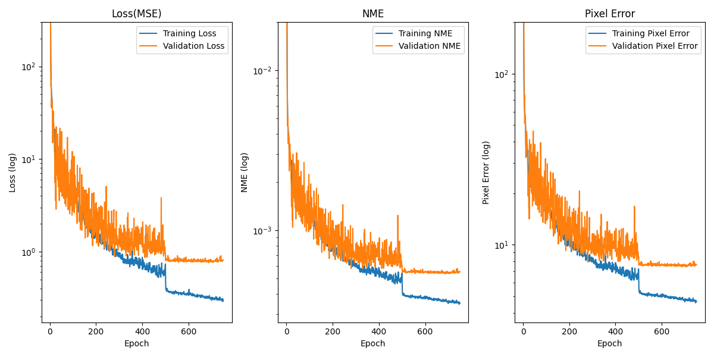

# Hip-Joint-Keypoint-Detection-Template

## Overview | 概述

這是一個使用 PyTorch 所實作的 **髖關節關鍵點偵測的深度學習模板**。
用於判斷小兒髖關節發育不良（IHDI）的分析，其結果可用於臨床診斷與治療。此模板基於 EfficientNet-V2 模型，並提供了自訂 Dataset、訓練流程、預測功能以及結果可視化等功能。


## Features | 功能特色

- 使用 EfficientNet-V2 預訓練模型作為骨幹
- 自訂 Dataset，可輕鬆擴充至不同數量的關鍵點
- 自動計算像素誤差（Pixel Error）作為驗證指標
- 內建關鍵點可視化，方便確認標註與預測結果
- 自動繪製訓練與驗證的 Loss / Pixel Error 曲線並儲存
- 會自動保存驗證集表現最佳的模型
- 將預測 IHDI 分類、Acetabular index 角度、平均誤差距離、平均誤差角度、角度散點及相關性分析圖等結果

## Project Structure | 專案結構

```
├── train.py # 訓練
├── predict.py # 預測
├── train_template.py # 訓練的參考模板
├── data/ # 存放影像與標註
│ ├── train/
│ │ ├── images/ # 訓練影像
│ │ └── annotations/ # 訓練 CSV 標註
│ └── val/
│ ├── images/ # 驗證影像
│ └── annotations/ # 驗證 CSV 標註
│ ├── test/
│ │ ├── images/ # 測試影像
│ │ └── annotations/ # 測試 CSV 標註
├── models/ # 保存訓練好的模型
├── logs/ # 訓練過程的圖表
└── results/ # 預測結果
```

## Dataset | 資料集

本研究採用回溯性資料，收集來自成大醫院於 2015 年 1 月 1 日至 2025 年 1 月 19 日期間，接受髖部超音波檢查之 4 歲以下嬰幼兒之 X 光影像資料。共納入 622 份 X 光影像，影像內容涵蓋髖關節發育正常與發育不良之個案。每張影像均經臨床專業醫師手動標註十二個關鍵點，作為後續模型訓練之標籤。

- 每張圖片對應一個標註 `.csv` 檔案，內容類似：
```
"(x1,y1)","(x2,y2)",...,"(x12,y12)"
```


## Installation | 安裝

按照以下方式安裝所需的 Python 環境與套件，或是直接執行再補上缺少的套件。

### 使用 Conda 創建虛擬環境

1. Clone the repository:
```
   git clone https://github.com/yourusername/Hip-Joint-Keypoint-Detection-Template.git
   cd Hip-Joint-Keypoint-Detection-Template
```
2. Create a Conda environment:
```
   conda create -n hip_joint_detection python=3.10
   conda activate hip_joint_detection
```
3. Install the required packages:
```
   pip install -r requirements.txt
```

### 使用一般 Python 環境

1. Clone the repository:
```
   git clone https://github.com/yourusername/Hip-Joint-Keypoint-Detection-Template.git
   cd Hip-Joint-Keypoint-Detection-Template
```
2. Install the required packages:
```
   pip install -r requirements.txt
```

## Usage | 使用方法

### Train | 訓練

使用方式：
```
usage: train.py [-h] [--epochs EPOCHS] [--lr LR] [--batch_size BATCH_SIZE] [--model_name MODEL_NAME]

Train a keypoint detection model

optional arguments:
  -h, --help            show this help message and exit
  --epochs EPOCHS       Number of training epochs
  --lr LR               Learning rate
  --batch_size BATCH_SIZE
                        Batch size
  --model_name MODEL_NAME
                        Model name
```

範例執行：
```
python train.py --epochs 200 --lr 1e-2 --batch_size 32 --model_name efficientnet_ms_cbam_3scales
```

訓練過程中會自動：
- 顯示第一張圖的關鍵點位置
- 每個 epoch 輸出 Train / Val Loss 與 Pixel Error
- 保存最佳模型至 models/
- 繪製訓練曲線至 logs/

訓練結果：
- 最佳模型會存為：
```
models/{model_name}_{epochs}_{lr}_{batch_size}_best.pth
```
- 訓練過程圖表會存為：
```
logs/{model_name}_{epochs}_{lr}_{batch_size}.png
```



### Prediction | 預測

使用方式：
```
usage: predict.py [-h] --model_name MODEL_NAME --model_path MODEL_PATH --data DATA [--output_dir OUTPUT_DIR]

optional arguments:
  -h, --help            show this help message and exit
  --model_name MODEL_NAME
                        Model name: 'efficientnet', 'efficientnet_ms_cbam_3scales'
  --model_path MODEL_PATH
                        path to the trained model
  --data DATA           data directory
  --output_dir OUTPUT_DIR
                        output directory for predictions
```

範例執行：
```
python predict.py --model_name efficientnet_ms_cbam_3scales --model_path models/efficientnet_ms_cbam_3scales_200_0.01_32_best.pth --data data/test --output_dir results/
```

預測結果：
- 將結果存到指定的 `output_dir`，包含：
  - 每張圖片預測的可視化圖
  - IHDI 分類結果
  - Acetabular index 角度
  - 平均誤差距離與角度
  - 散點圖與相關性分析圖


  